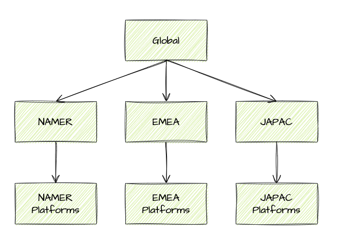

  

<h2 align="center" >C.E.R.A</h1>
<h1 align="center" >CircleCI Enterprise Reference Architecture</h1>

# A new monorepo for CERA Terraform deployment

## Index
- [What is CERA?](#What-is-CERA?)
- [Why do we need CERA?](#Why-do-we-need-CERA?)
- [Goals of CERA](#Goals-of-CERA)
- [Wall of Work and Organization](#Wall-of-Work-and-Organization)
- [Diagrams](#Diagrams)
- [Cluster Information](#Cluster Information)
- [Development Workflows](#Development Workflows)

## What is CERA?
CERA, CircleCI Enterprise Reference Architecture, is a full scale enterprise environment that includes the following services:

[comment]: <> (- CircleCI Server running on Kubernetes)
[comment]: <> (- CircleCI Runners deployed on VMs and Kubernetes)
- Full Stack Logging Solution
- Re-deployable infrastructure using infrastructure as code
- A production like application - Bank of Aoin
- CircleCI's Fieldguide
[comment]: <> (- On Prem VCS)
- Artifact Repository
- Container Registry
- `TODO: Add more services`

## Why does CircleCI need CERA?
CERA grew from the need of CircleCI shifting to larger enterprise customers. To make a truly impactful demo for enterprise customers it is important to understand an enterprise like environment, the pain points surrounding an enterprise like environment,
and what technologies are in an enterprise like environment.

## Goals of CERA
Focusing our talented Solutions Engineering team's effort on supporting CircleCI's Enterprise Reference Architecture, the goals are as follows:

- Have an effective environment to showcase CircleCI's enterprise level features
- Show off more complex use cases of CircleCI's platform
- Have an environment that can be tailored to different personas inside an enterprise customer (Mobile Developer, DevOps Engineer, Frontend/Backend Developer, Centralized Ops Team)
- Flexible environment that is easy to add or modify
- Re-deployable with little to no effort
- Easily Maintainable
- `TODO: Define and solidify goals with team`

At the end of the day CircleCI needs an environment that Solutions Engineering can utilize for demos.

## Wall of Work and Organization
CERA has a lot of moving parts and will require collaboration to be complex. In order to stay organized this project will be utilizing [JIRA](https://circleci.atlassian.net/jira/software/projects/SE/boards/392).
JIRA will act as a wall of work where individuals can look and be assigned tasks. By utilizing JIRA the Solutions Engineering team can effectively collaborate on multiple tasks across different time zones.

[comment]: <> (**How we work**, including cermonies and motions is documented [on the company wiki](https://circleci.atlassian.net/wiki/spaces/CE/pages/6576177159/Tracking+Dev+Work+in+Solutions). Please make sure you understand the guidance there before contributing.)

## Diagrams
[Here](https://drive.google.com/file/d/1hYCSr-1dme95koshN_0nmEKLA9JI3yEs/view?usp=sharing) is the link to the diagrams!

## Cluster Information
[Here](https://circleci.atlassian.net/wiki/spaces/CE/pages/6582469344/CERA+Customer+Engineering+Cluster+Details) is the link containing information on accessing the CERA EKS Cluster. (CCI Employees only)

[comment]: <> (##Development Workflows

### If making changes to the main CERA cluster, the workflow is as follows:

- Create a feature branch and make your changes.
- Once those changes are pushed, the CircleCI pipeline will begin to run through the test-and-deploy-terraform workflow.
- The test-and-deploy-terraform workflow includes the entire cluster lifecyle, with jobs to provision the cluster, 
   create the cluster service accounts, and a hold job that on approval will destroy the cluster. (Do not approve the hold job until later steps)
- The workflow automatically creates a new cluster with the branch name appended to the default cluster naming convention (cera-solutions-eng),
   and will also provision boa-service accounts for your cluster as well as terraform statefiles and a dynamoDB lock entry.
- Once the changes have been made on your branch, and you are ready to merge into main, seek approvals.
- Once the changes are reviewed and approved, proceed to approve the hold job in CircleCI, and wait for the cluster to be destroyed.
- Once the cluster tears down successfully, you will have passing checks in GitHub and you will be able to merge your branch into main.

### To initiate the teardown of a cluster that is not the main CERA cluster

- Trigger the pipeline via the CircleCI UI passing a parameter with *statefile_to_destroy* as the key, and the statefile name as the value. (The statefile name will be the name of the branch that created the cluster.))

## Use Cases

### Global Trigger
1. Global -> Everything
    * Global -> NAMER -> NAMER-Platforms
    * Global -> EMEA -> EMEA-Platforms
    * Global -> JAPAC -> JAPAC-Platforms

### Namer-all
1. NAMER -> NAMER-Platforms
2. NAMER-Platforms

### EMEA-all
1. EMEA -> EMEA-Platforms
2. EMEA-Platforms

### JAPAC-all
1. JAPAC -> JAPAC-Platforms
2. JAPAC-Platforms

### Platforms
1. NAMER-Platforms
2. EMEA-Platforms
3. JAPAC-Platforms

